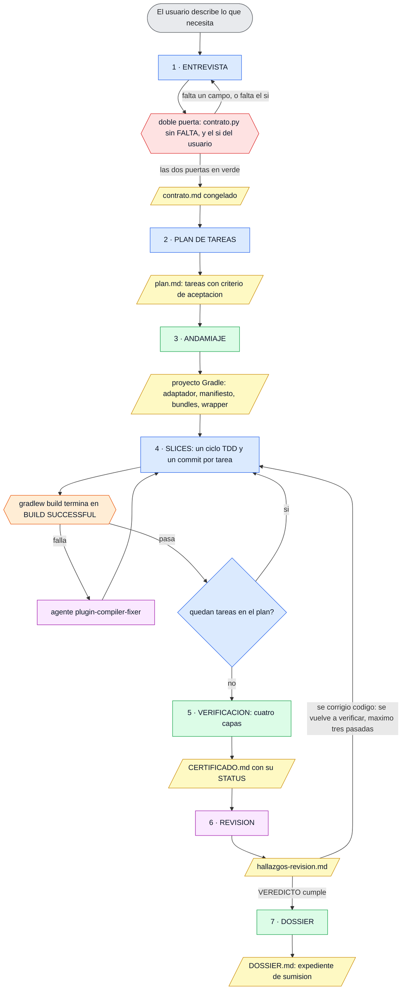
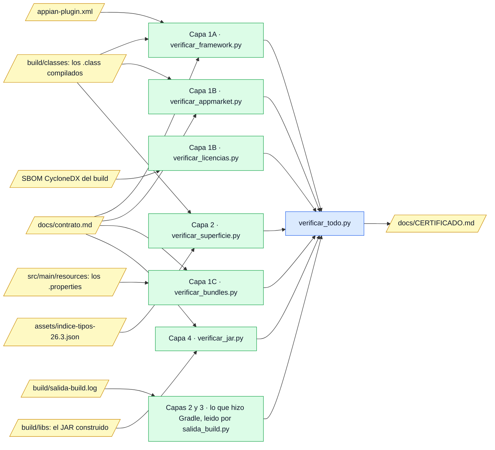
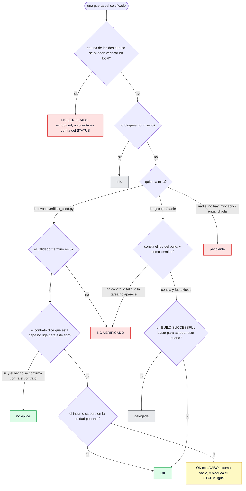
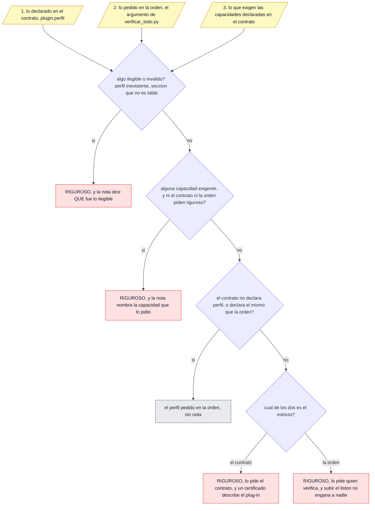

# Cómo funciona `appian-plugin-forge`

Mapa visual del plugin: qué hace en cada paso, **quién** lo hace y **con qué**. Sirve de
documentación y de recordatorio de un vistazo para quien lo mantiene.

**Este documento no define ninguna regla: las señala.** La regla de la casa es enlazar en vez de
duplicar, porque dos copias divergen. Dónde vive cada cosa:

| Si buscas… | Está en |
|---|---|
| El procedimiento que se ejecuta de verdad | `skills/crear-plugin-appian/SKILL.md` |
| Las reglas de validación, con su fuente y su ID | `assets/reglas-de-validacion.md` |
| Cómo se lee la tabla del certificado | `skills/crear-plugin-appian/referencias/certificado.md` |
| El formato de la entrevista y las siete preguntas | `skills/crear-plugin-appian/referencias/entrevista.md` |
| Cómo se deduce el tipo de plug-in | `skills/crear-plugin-appian/referencias/tipos-de-plugin.md` |
| El porqué de cada decisión de diseño | `docs/superpowers/specs/2026-08-08-appian-plugin-forge-design.md` (repo de desarrollo; no viaja con el plugin) |

### Convención de rutas, que aquí hace falta

Este documento habla de tres árboles distintos y los tres tienen un `docs/`:

- **Sin prefijo** — relativo a la raíz de este plugin: `scripts/andamiar.py`,
  `assets/plantillas/`, `skills/crear-plugin-appian/SKILL.md`.
- **`<proyecto-generado>/…`** — el plug-in de Appian que la skill produce, que es otro repositorio
  con su propio `docs/`: `<proyecto-generado>/docs/CERTIFICADO.md`.
- **Con la coletilla «(repo de desarrollo)»** — material de diseño que vive fuera del plugin y **no
  viaja con él**: la spec, la auditoría y la retrospectiva.

Unos pocos ficheros del proyecto generado aparecen por su nombre suelto cuando el contexto ya deja
claro de quién son —`build.gradle`, `appian-plugin.xml`, `config/spotbugs/exclude.xml`, los
`.properties`—. Ninguno de ellos existe en este repositorio: aquí solo están sus plantillas.

---

## 1 · Por qué el sistema tiene esta forma

Una sola asimetría lo explica casi todo: **un plug-in de Appian no se puede ejecutar antes de
entregarlo**. Appian exige aprobación previa —AppMarket público o uso privado por igual—, con sus
propios escaneos, y documenta que una función queda disponible «within a week» (spec §3.3). De ahí
las dos consecuencias que rigen la skill entera: *nunca se prueba lo generado antes de entregarlo*,
y *cada error que no se atrape en local cuesta un ciclo completo de una semana*.

De ahí también el defecto que este sistema persigue por encima de cualquier otro: el **verde
vacuo** —algo que produce un resultado plausible sin haber hecho el trabajo—, que apareció **siete
veces en siete sitios distintos** durante la Fase 1 (`docs/retrospectiva-fase1.md` §1, repo de
desarrollo). Un escáner que recorre cero clases, un `BUILD SUCCESSFUL` sobre cero tests, un
certificado que nunca leía el resultado del build. La pregunta que los encuentra, y que conviene
hacerle a toda pieza capaz de reportar éxito, es:

> ¿Qué trabajo respalda este verde, y **cómo se vería si no se hubiera hecho**?

Casi todo lo que parece paranoia en el certificado —la columna de insumo, los seis estados, las dos
filas siempre rojas— es la respuesta a esa pregunta.

---

## 2 · El flujo completo de CREAR

Siete pasos numerados. El contrato (`<proyecto-generado>/docs/contrato.md`) no es un paso: es el
artefacto congelado que produce el paso 1 y del que leen los pasos 3, 5 y 7.

**Cómo leer los colores.** Azul, lo hace **Claude leyendo la skill** (requiere juicio); verde, un
**script determinista**; morado, un **agente** lanzado con la herramienta `Agent`; naranja,
**Gradle** dentro del proyecto generado; amarillo, un **artefacto** en disco; rojo, una **puerta**
que hay que pasar. Esa separación es la tesis del proyecto: *lo determinista lo hacen scripts, y lo
que exige juicio lo hace el modelo*.

### Leyenda: qué se hace, quién lo hace y con qué

| Paso | Qué se hace | Quién | Herramienta concreta | Criterio de salida |
|---|---|---|---|---|
| **1 · ENTREVISTA** (DEFINE) | Una pregunta por turno, sin opción múltiple, formato `Q`/`GUESS`/`CONFIDENCE`. El tipo de plug-in y el perfil **no se preguntan**: se deducen y se proponen con su porqué. Produce el contrato: un Markdown con un bloque TOML | Claude leyendo la skill, **más** un script para la puerta determinista | `skills/crear-plugin-appian/referencias/entrevista.md` y `skills/crear-plugin-appian/referencias/tipos-de-plugin.md`; puerta: `scripts/contrato.py` | Doble puerta: `scripts/contrato.py` sin ninguna línea `FALTA` **y** un «sí» explícito del usuario, hoy exigido técnicamente vía `[confirmacion].usuario_confirmo` y no solo por convención. Ninguna basta sola |
| **2 · PLAN DE TAREAS** (PLAN) | El contrato se descompone en slices verticales pequeños y verificables, cada uno con su criterio de aceptación y los requisitos que cubre | Claude leyendo la skill | Ninguna: se escribe `<proyecto-generado>/docs/plan.md` | Todo input y todo output del contrato está cubierto por al menos una tarea |
| **3 · ANDAMIAJE** (BUILD, 1) | Sustitución de variables sobre las plantillas: adaptador de Appian, `build.gradle` compuesto según el perfil, wrapper de Gradle, `appian-plugin.xml`, los `.properties` `_en_US`/`_es_ES` (salvo servlet) y una copia literal del contrato en el destino. **Sin modelo de por medio** | Script determinista | `scripts/andamiar.py` sobre `assets/plantillas/` | El script termina en 0 y cada ruta que imprime como escrita existe de verdad. Ojo: lo que falta no se imprime, así que este criterio no ve las ausencias |
| **4 · SLICES** (BUILD, 2) | Un ciclo TDD completo por tarea —casos JUnit primero, lógica mínima después— y un commit atómico. Nunca más de un slice abierto. La lógica va en el **dominio**, que no importa `com.appiancorp.*`; el adaptador solo traduce | Claude escribe; un **agente** cierra el bucle compilar/corregir; **Gradle** ejecuta | Agente `appian-plugin-forge:plugin-compiler-fixer`; `./gradlew build` del proyecto generado; para dudas de API, `javap` sobre el JAR del SDK y el agente `appian-plugin-forge:appian-docs-researcher` | `BUILD SUCCESSFUL` en la salida real al cierre de cada slice, y exactamente un commit nuevo por tarea. Única excepción admitida: el `SECSP` de un servlet cuya lógica aún no se ha escrito |
| **5 · VERIFICACIÓN** (VERIFY) | Se ejecutan las cuatro capas disponibles, se lee la salida real del build y se emite el certificado. Antes, la salida del build se captura en la ruta convenida `<proyecto-generado>/build/salida-build.log` —con `--console=plain`, y creando `build/` si no existe, porque la redirección no crea el directorio— | Script determinista, que además **lee** lo que hizo Gradle | `scripts/verificar_todo.py <raíz> <perfil>`, que invoca los seis validadores y `scripts/salida_build.py` | Tres partes, todas sobre el certificado: ninguna puerta en «pendiente»; ninguna en «NO VERIFICADO» salvo las dos estructurales; y cada puerta delegada con la salida real de quien la ejecuta. El `STATUS` de la cabecera ya publica el veredicto |
| **6 · REVISIÓN** (REVIEW) | La única lente de juicio del pipeline compara el código contra el contrato requisito a requisito y mira lo que ningún script mecaniza: separación dominio/adaptador, estado mutable en clases de función, `ServiceLocator` en constructores, errores y recursos | Agente | Agente `appian-plugin-forge:plugin-contract-reviewer`; su salida se escribe tal cual en `<proyecto-generado>/docs/hallazgos-revision.md` | `VEREDICTO: cumple`, o cada hallazgo corregido y vuelto a pasar. **Tope de tres pasadas**; a la tercera con hallazgos altos, se escala a decisión humana. **Y si se corrigió una sola línea, se vuelve al paso 5 antes del 7**: el certificado que emitió aquel paso describe el árbol de antes de la corrección, y es el que el dossier empotra. La red que lo declara —el aviso `RANCIO`— existe, pero declararlo no es el procedimiento: el procedimiento es volver a verificar |
| **7 · DOSSIER** (SHIP) | Se reúnen las seis piezas del expediente: contrato, decisiones, inventario de API extraído del bytecode, certificado, historial y **firma pública congelada**. En la misma pasada, sin preguntar nada nuevo, se derivan además dos documentos de usuario que **no** son piezas del dossier | Script determinista | `scripts/generar_dossier.py <raíz>` → `<proyecto-generado>/docs/DOSSIER.md`; `scripts/generar_documentacion_usuario.py <raíz>` → `GUIA_INTEGRACION.md` y `FICHA_APPMARKET.md` | Las seis piezas presentes, y la firma congelada correspondiente al contrato final aceptado en el paso 1 |

**Tres avisos que la leyenda no puede resumir sin traicionarlos:**

- **El destino tiene que ser un repositorio git, y no lo crea el andamiaje.** `scripts/andamiar.py`
  escribe ficheros y nada más: quien sigue la skill inicializa el destino como repositorio si
  todavía no lo es, antes de abrir el primer slice. El motivo es el criterio de salida del paso 4,
  que exige **un commit por tarea**; y la consecuencia de saltárselo es visible, porque
  `scripts/verificar_todo.py` escribe en la cabecera del certificado que no hay repositorio al que atar lo
  certificado, en vez de callar.
- **El dominio no se andamia.** El paso 3 genera el adaptador; la separación dominio/adaptador la
  construye el paso 4. Un andamiaje recién generado declara `0 clases de dominio` en el
  certificado, que es legítimo y visible, no un aprobado.
- **`scripts/generar_dossier.py` reescribe el fichero entero en cada pasada.** Por eso las dos piezas de
  prosa que no se derivan de ningún artefacto —`<proyecto-generado>/docs/decisiones.md` y
  `<proyecto-generado>/docs/hallazgos-revision.md`— viven fuera y él solo las lee. Escribirlas
  dentro del dossier es perderlas en la siguiente ejecución.

---

## 3 · Las cuatro capas de validación

Todas mecanizadas por script y reunidas por `scripts/verificar_todo.py`. **Las reglas concretas,
con su fuente oficial y su identificador, viven en `assets/reglas-de-validacion.md` y no se copian
aquí**: aquí solo está quién las ejecuta y sobre qué evidencia.

En el diagrama, los artefactos de la izquierda son del **proyecto generado**; el único que sale de
este plugin es el índice de tipos.

| Capa | Qué atrapa | Ejecutor | Evidencia sobre la que decide | Reglas |
|---|---|---|---|---|
| **1A** · Reglas del framework | Lo que impide desplegar o hace que Appian reclasifique el plug-in en silencio | `scripts/verificar_framework.py` | El contrato, el manifiesto y el **bytecode** de las clases compiladas | `R-F01`–`R-F13` (más `R-F01b`, que reporta bajo `R-F01`) |
| **1B** · Políticas de AppMarket | Lo que hace que el revisor de Appian rechace el envío | `scripts/verificar_appmarket.py` | Bytecode, nunca fuente | `R-A01`–`R-A10` |
| **1B** · Licencias de terceros | Copyleft entre las dependencias: la política más tajante de AppMarket y la única con un absoluto | `scripts/verificar_licencias.py` | El SBOM CycloneDX que genera el propio build (nada de red en tiempo de verificación) | `R-L01`–`R-L02` |
| **1C** · Bundles y locales | El bloqueante número uno: sin el bundle `_en_US` correcto el plug-in **no despliega**. Todos los bundles salen con los acentos escapados a `\uXXXX`, `_en_US` incluido: es el locale del que Appian saca los textos de display, o sea el único cuyo mojibake vería un usuario, y escapar es seguro lea quien lea el `.properties` | `scripts/verificar_bundles.py` | Los `.properties` bajo `src/main/resources`, contra el tipo declarado en el contrato | `R-B01`–`R-B06` |
| **2** · Compilación y superficie de API | Clases y firmas inventadas, y uso de API no documentada **también cuando no hay `import`** | `./gradlew build` + `scripts/verificar_superficie.py` | Bytecode contra `assets/indice-tipos-26.3.json` | Índice de tipos del SDK 26.3 |
| **3** · Tests unitarios | Comportamiento contra el contrato | JUnit 5 + Mockito, vía `./gradlew build` | El log del build, leído por `scripts/salida_build.py` | — |
| **4** · Empaquetado del artefacto | Fuente embebida, manifiesto en la raíz, cierre de dependencias, licencias, entradas duplicadas | `scripts/verificar_jar.py` | El JAR ya construido, no el árbol de fuentes | `R-J01`–`R-J09` |

**Tres cosas que explican por qué las capas están montadas así:**

- **Bytecode y no fuente** (decisión D16). Un nombre cualificado no genera `import`, y la reflexión
  tampoco: el *constant pool* contiene toda referencia real. `scripts/classfile.py` lo lee una sola
  vez, y esa pasada alimenta a la vez la puerta de la capa 2 y el inventario de API del dossier,
  así que los dos no pueden desincronizarse.
- **El orquestador no invoca Gradle, pero sí lee lo que Gradle hizo.** `scripts/salida_build.py`
  distingue cinco desenlaces, y solo dos son constancia de algo: **exitoso** y **fallido**. Los
  otros tres —ausente, **rancio** e indeterminado— valen lo mismo que un `BUILD FAILED`. No poder
  mirar no es «ya lo miraremos».
- **La rancidez es una sola mecánica con dos listas de insumos, y las listas son explícitas.**
  Un artefacto derivado está rancio si es anterior a cualquiera de sus insumos. Para el **log del
  build** esos insumos son el árbol de `src/` entero —no solo los `.java`: `build` reejecuta
  `processResources` y `jar`, así que tocar `appian-plugin.xml` o un bundle cambia el JAR—, más
  `build.gradle`, el `exclude.xml`, los dos textos legales que acaban en `META-INF` y el
  `gradle-wrapper.properties`. Para el **certificado** son esos mismos más `docs/contrato.md`. La
  lista se escribe a mano y se amplía a mano: la forma universal «todo lo que el build consume»
  se probó y era falsa, porque prometía cubrir ficheros que nadie miraba.
- **Esa misma mecánica es lo único que protege al JAR**, porque la capa 4 no compara fechas: abre
  el JAR que encuentra y mira dentro. Corregir un recurso sin reconstruir deja el log rancio, sus
  filas en rojo y el `STATUS` lejos de `READY_FOR_APPIAN_SUBMISSION`. Y el dossier empotra el
  certificado **marcado como `RANCIO`** si es anterior a sus insumos, en vez de callarlo: lo
  ausente ya se declaraba, lo rancio no se veía.
- **Si falta el índice de tipos, el escáner no se detiene**: conmuta a un filtro grueso por paquete
  —que deja pasar clases no documentadas— y lo **declara en el certificado** como modo degradado.
  Ese índice lo regenera a mano `scripts/generar_indice_tipos.py` cuando cambia la versión del SDK.

---

## 4 · El certificado: 13 filas en ESTÁNDAR, 17 en RIGUROSO

El certificado (`<proyecto-generado>/docs/CERTIFICADO.md`) **es un libro mayor, no un binario**:
qué puertas pasaron con qué evidencia, cuáles no y por qué. Lo escribe
`scripts/verificar_todo.py`. Cómo se lee la tabla, en
`skills/crear-plugin-appian/referencias/certificado.md`.

Once puertas comunes + dos estructurales = **13 filas en ESTÁNDAR**. El perfil RIGUROSO añade
cuatro = **17 filas**.

| # | Puerta | Perfil | Quién la ejecuta |
|---|---|---|---|
| 1 | Reglas del framework de Appian | ambos | `scripts/verificar_framework.py` |
| 2 | Políticas AppMarket | ambos | `scripts/verificar_appmarket.py` |
| 3 | Bundles y locales | ambos | `scripts/verificar_bundles.py` |
| 4 | Compilación · SDK 26.3 / release 17 | ambos | delegada a Gradle (`:compileJava`), resuelta leyendo el log |
| 5 | Superficie documentada · índice 26.3 | ambos | `scripts/verificar_superficie.py` |
| 6 | Deriva contra la versión del entorno | ambos | **informativa**: no bloquea, su mecanización es insumo de la Fase 3 |
| 7 | Tests unitarios | ambos | delegada a Gradle (`:test`) |
| 8 | SpotBugs + FindSecBugs | ambos | delegada a Gradle (`:spotbugsMain`) |
| 9 | Licencias de terceros | ambos | `scripts/verificar_licencias.py` |
| 10 | Empaquetado y cierre de dependencias | ambos | `scripts/verificar_jar.py` |
| 11 | Bytecode del artefacto · major 61 | ambos | delegada, y **sigue delegada** aunque el build pase (ver más abajo) |
| 12 | Cobertura JaCoCo 95 / 85 | riguroso | delegada a `:jacocoTestCoverageVerification` |
| 13 | Mutación PIT ≥ 85 % | riguroso | delegada a `:mutationTest` |
| 14 | Property tests y fuzz sembrado | riguroso | delegada a `:test`, y medida en *property tests*, no en tests |
| 15 | Build reproducible | riguroso | delegada a `:releaseCheck`, y **nunca llega a verde** (ver más abajo) |
| 16 | Resolución OSGi en la plataforma | ambos | **nadie: siempre en rojo** |
| 17 | Ejecución en Appian real | ambos | **nadie: siempre en rojo** |

### Los seis estados de una puerta, y cómo se llega a cada uno

| Estado | Qué significa | Vale como pasado |
|---|---|---|
| `OK` | Se ejecutó y salió bien, sobre un insumo real | Sí |
| `NO VERIFICADO` | Se miró y no pasó, o no se pudo mirar (sin JAR, sin log, log rancio) | No |
| `info` | No bloquea por diseño. **La lleva exactamente una fila**: la deriva contra la versión del entorno | No cuenta en contra |
| `delegada` | La ejecuta otro, y la evidencia dice quién. **Delegar no es aprobar** | No |
| `no aplica` | Esa capa no rige para este tipo de plug-in. Se deriva de un **hecho declarado en el contrato** (`plugin.tipo = servlet`), nunca de una ausencia de insumo, y el orquestador lo comprueba contra el contrato | Sí |
| `pendiente` | Nadie la ejecutó y nadie dijo por qué. Es el único estado sin explicación, y por eso es el que no puede quedar | No |

**La regla que no se negocia:** una puerta que no se ejecutó **nunca** se marca como pasada. Ni
«pendiente» ni «delegada» son «OK». Si «delegada» colara, declarar motivos se convertiría en la vía
limpia para blanquear una puerta sin ejecutarla.

**Y la segunda:** un verde sobre un insumo vacío no cuenta como verde. Cada puerta declara en su
propia columna **cuánto** analizó —clases, tipos, claves esperadas, entradas del JAR, dependencias,
tests—, y seis puertas en RIGUROSO (cinco en ESTÁNDAR) declaran además su **unidad portante**: la
que a cero significa «no se verificó nada». El caso canónico es un `BUILD SUCCESSFUL` sobre
`> Task :test NO-SOURCE`, que es lo que imprime de verdad un proyecto recién andamiado: cero tests.

### El `STATUS`, que ahorra interpretar la tabla

La cabecera abre con `**STATUS: READY_FOR_APPIAN_SUBMISSION**` o `**STATUS: NOT_READY**` y, cuando
dice `NOT_READY`, lista debajo qué puerta lo impide y por qué, una línea por motivo. Lo decide
`verificar_todo.estado_de_sumision` con cuatro condiciones: ninguna puerta pendiente; ninguna en
rojo salvo las dos estructurales; ninguna delegada salvo las que un `BUILD SUCCESSFUL` no puede
aprobar; y **ningún verde sobre un insumo vacío**.

La cabecera declara además el perfil resuelto, la versión del SDK, la del índice de tipos **con su
hash**, la revisión de git y si `./gradlew build` se ejecutó y cómo terminó. Sin el hash y la
revisión, dos dossieres de fechas distintas son indistinguibles.

**El código de salida distingue tres desenlaces, y el tercero no es un veredicto.** `0`, ninguna
fila roja que cuente; `1`, las hay —una verificación que sí ocurrió y salió mal—; y `2`, la raíz
que se pasó **no existe o no es un directorio**: ahí no se escribe certificado ni se crea ningún
directorio. Hasta el ciclo 12 ese caso producía un certificado entero, de ocho mil caracteres,
sobre un proyecto inexistente: diez filas rojas cuyo contenido real era «te equivocaste de ruta»,
más un directorio nuevo en el sitio equivocado. Un documento con forma de veredicto es peor que
un error, porque se archiva.

### Por qué dos filas van SIEMPRE en rojo

**«Resolución OSGi en la plataforma»** y **«Ejecución en Appian real»** salen en rojo en todos los
certificados que este sistema emite, y eso es la función del documento, no un defecto suyo:

- La **resolución OSGi** de la plataforma no tiene contenedor equivalente en local (riesgo R13 de
  la spec). La capa 4 atrapa el fallo más probable —una clase que falta— pero no un conflicto de
  versiones con lo que Appian ya tiene cargado.
- La **ejecución en Appian real** es imposible sin despliegue aprobado, que es exactamente la
  asimetría con la que empieza este documento.

La alternativa sería peor de dos maneras distintas: ponerlas en verde sería la forma más pura del
verde vacuo, y omitirlas dejaría al lector sin saber que ahí hay un hueco. **Por eso se excluyen
expresamente del cálculo del `STATUS`**: si contaran en contra, ningún plug-in sería `READY` jamás,
y una alarma que salta siempre enseña a ignorarla. Un rojo declarado no es un defecto del plug-in:
es el límite honesto de la verificación local.

**No confundirlas con las dos puertas que sobreviven «delegada»**, que son otra cosa y por otro
motivo:

| Fila | Por qué no llega a verde |
|---|---|
| Bytecode del artefacto · major 61 | `R-A09` ya comprueba *major* 61 sobre `build/classes`, pero sobre las copias **dentro** del JAR no hay regla documentada, y un `BUILD SUCCESSFUL` no las mira. La fila registra igualmente que el build corrió y cómo terminó |
| Build reproducible | La plantilla lo **configura** (`preserveFileTimestamps`, `reproducibleFileOrder`) pero ninguna tarea lo **comprueba**: verificarlo exige construir dos veces y comparar el hash del JAR, y `releaseCheck` no lo hace. Si nadie ejecutó el perfil, la fila sale **roja**; si se ejecutó, se queda **delegada** diciendo qué es lo que esa tarea no mira |

---

## 5 · Los dos perfiles, y quién decide cuál rige

| | ESTÁNDAR | RIGUROSO |
|---|---|---|
| Reglas del framework y políticas de AppMarket | Sí | Sí — **innegociables en los dos perfiles** |
| Compilación, superficie de API, tests, empaquetado | Sí | Sí |
| Cobertura JaCoCo 95 / 85 | — | Añadida |
| Mutación PIT ≥ 85 % | — | Añadida |
| Property tests y fuzz sembrado | — | Añadida |
| Build reproducible | — | Añadida |
| Filas del certificado | 13 | 17 |
| Cómo se materializa en el proyecto generado | `assets/plantillas/comun/build.gradle.tmpl` | el mismo, **más** el bloque de `assets/plantillas/perfil-riguroso.gradle.tmpl` |

**El perfil no cambia qué reglas se cumplen, solo qué puertas se ejecutan** (spec §2.3). Se propone
—no se pregunta aparte— a partir de cuatro de las preguntas de admisión de la entrevista:
`parsea_formatos_ajenos`, `sale_a_la_red`, `toca_credenciales` y `datos_personales`. La lista es
corta a propósito: si casi todo dispara RIGUROSO, el perfil deja de distinguir nada.

### La resolución entre tres reclamantes

Hay tres sitios donde alguien puede reclamar un perfil, y **manda el más estricto**. Lo resuelve
`verificar_todo._resolver_perfil`, y **el certificado dice cuál ganó y por qué**, en la propia
cabecera.

Dos consecuencias que conviene tener presentes:

- **Nada ilegible se resuelve a favor.** Un perfil que no existe —declarado o pedido, incluida una
  errata de una letra—, o una sección `[plugin]` o `[capacidades]` que no es una tabla, llevan al
  listón alto, y **todas las averías se recogen antes de decidir** para que la primera no tape a
  las siguientes. El motivo es concreto: verificar con el listón bajo no haría *fallar* a las
  cuatro filas rigurosas, las haría **desaparecer**, y el certificado quedaría más limpio por haber
  mirado menos.
- **Declarar `estandar` con capacidades exigentes no ahorra nada.** La puerta determinista lo marca
  como `AVISO` —que no es una `FALTA` y no bloquea—, y la verificación sube el perfil por su
  cuenta. Lo único que se consigue es apartar las cuatro puertas de la vista de quien lea el
  contrato. El perfil se decide en la entrevista, con el usuario delante.

---

## 6 · Mapa de piezas

Índice del repositorio, una línea por pieza.

### `scripts/` — dieciséis scripts, solo biblioteca estándar de Python 3.11+

| Script | Qué hace |
|---|---|
| `scripts/contrato.py` | Esquema del contrato y **puerta determinista** de la entrevista. Comprueba también la FORMA de **nueve secciones** —las ocho que consume el andamiador más `[capacidades]`, que leen el resolutor de perfil y el orquestador— y la de los elementos de sus listas, porque un contrato mal tecleado tiene que salir como línea `FALTA` —lo único que su lector sabe leer— y nunca como traza. Todas, no las que sea fácil: `dependencias` como cadena suelta se iteraba letra a letra y el `build.gradle` salía con un `implementation` por carácter, con la puerta en verde. Además, el vocabulario compartido: perfiles, tipos, paletas válidas, línea de insumo, marca de `no aplica`, escapes Unicode |
| `scripts/andamiar.py` | Andamiaje por sustitución de variables sobre `assets/plantillas/`. Sin modelo de por medio. Reandamiar sobre un proyecto existente apuntando a su propio `docs/contrato.md` es un caso normal, no un error: ahí no hay nada que copiar y el contrato se queda intacto |
| `scripts/classfile.py` | Lector de ficheros `.class`: *constant pool*, *major version* y métodos. Una sola pasada alimenta la capa 2 y el inventario del dossier |
| `scripts/verificar_framework.py` | Capa 1A: reglas del framework de Appian (`R-F*`) |
| `scripts/verificar_appmarket.py` | Capa 1B: políticas de AppMarket sobre bytecode (`R-A*`) |
| `scripts/verificar_licencias.py` | Capa 1B: copyleft entre las dependencias, leyendo el SBOM (`R-L*`) |
| `scripts/verificar_bundles.py` | Capa 1C: bundles, locales y paridad de claves (`R-B*`) |
| `scripts/verificar_superficie.py` | Capa 2: superficie de API usada contra el índice documentado; escribe también el inventario del dossier |
| `scripts/verificar_jar.py` | Capa 4: empaquetado y cierre de dependencias sobre el JAR ya construido (`R-J*`) |
| `scripts/salida_build.py` | Lee el resultado **real** de `./gradlew build` y lo trae al certificado. Cinco desenlaces, y tres de ellos no constan |
| `scripts/verificar_todo.py` | Orquesta las cuatro capas, resuelve el perfil y emite el certificado — o **se niega a emitirlo**: una raíz que no existe se rechaza con código 2 sin escribir nada |
| `scripts/generar_dossier.py` | Escribe el dossier de seis piezas, con la firma pública congelada |
| `scripts/generar_documentacion_usuario.py` | Deriva del contrato ya congelado dos documentos de usuario, sin preguntar nada nuevo: `GUIA_INTEGRACION.md` (desarrollador Appian que integra el plugin) y `FICHA_APPMARKET.md` (ficha de listado). Se generan en la misma pasada que el dossier, pero no son piezas del dossier: su audiencia es quien usa el plugin, no quien lo edita |
| `scripts/generar_indice_tipos.py` | Regenera `assets/indice-tipos-26.3.json` desde el javadoc. **A mano y rara vez**, cuando cambia la versión del SDK |
| `scripts/skill_lint.py` | Linter de las propias skills de este plugin: secciones exigidas, frontmatter y **cuatro familias de citas rotas** sobre `skills/crear-plugin-appian/SKILL.md` y los `.md` de `skills/crear-plugin-appian/referencias/` — las referencias (también las que se citan entre sí), las rutas a `scripts/`, `assets/` y `tests/` y los directorios citados con `${CLAUDE_PLUGIN_ROOT}`, los nombres de despacho de los agentes y los símbolos que la prosa manda mirar dentro de un script |
| `scripts/run_evals.py` | Evals de la skill: estructural y de disparo, con regla antitrampa, sobre `evals/cases/disparo.json` |

### `agents/` — tres agentes, cada uno con su recorte de herramientas

| Agente | Papel | Herramientas |
|---|---|---|
| `agents/appian-docs-researcher.md` | Única puerta a la documentación de Appian. Devuelve **un hecho con su fuente**, o «no encontrado» | MCP `appian-docs`, `WebFetch`, `Bash` solo de consulta |
| `agents/plugin-compiler-fixer.md` | Cierra el bucle compilar/corregir del paso 4. No relaja puertas, no borra tests, no toca el contrato para que compile | `Bash`, `Read`, `Edit`, `Glob`, `Grep` |
| `agents/plugin-contract-reviewer.md` | La **única lente de juicio**: ¿el código hace lo que dice el contrato, y respeta lo que ningún script mecaniza? | `Read`, `Glob`, `Grep` — solo lectura |

### `assets/` — lo que consumen los scripts

| Asset | Qué es |
|---|---|
| `assets/reglas-de-validacion.md` | El índice de reglas con su fuente oficial y su consecuencia. Es lo que permite responder «¿por qué me rechazas esto?» citando a Appian |
| `assets/indice-tipos-26.3.json` | Snapshot con hash de los tipos documentados del SDK 26.3, contra el que la capa 2 decide si una clase existe |
| `assets/dossier.md` | Referencia **estática** de la forma del dossier. No es una plantilla ejecutable: vive fuera de `assets/plantillas/` a propósito |
| `assets/plantillas/` | Lo que copia el andamiaje. Ver abajo |

### `assets/plantillas/` — el andamiaje

| Plantilla | Para qué |
|---|---|
| `assets/plantillas/comun/build.gradle.tmpl` | La cadena de build: toolchain 17, SpotBugs + FindSecBugs, SBOM CycloneDX, JAR reproducible y la verificación del propio JAR. **Deriva del proyecto de referencia**, no de la guía |
| `assets/plantillas/comun/settings.gradle.tmpl`, `assets/plantillas/comun/gitignore.tmpl`, `assets/plantillas/comun/LICENSE.tmpl`, `assets/plantillas/comun/THIRD_PARTY_NOTICES.md.tmpl` | El resto del esqueleto común del proyecto generado |
| `assets/plantillas/comun/spotbugs-exclude.xml.tmpl` | El `config/spotbugs/exclude.xml` del proyecto generado. Trae ya redactado, comentado y con su argumento el bloque del `SECSP` de servlets, para que la decisión se tome leyéndolo allí |
| `assets/plantillas/comun/gradlew`, `assets/plantillas/comun/gradlew.bat`, `assets/plantillas/comun/gradle/wrapper/` | El wrapper de Gradle 8.14.3, copiado en binario: cada proyecto generado lleva el suyo |
| `assets/plantillas/function/` | Clase, manifiesto y los dos bundles `_en_US`/`_es_ES` de una función |
| `assets/plantillas/writer-function/` | **Solo `assets/plantillas/writer-function/Clase.java.tmpl`**: su manifiesto y sus bundles son los de `function`, con los que es compatible |
| `assets/plantillas/smart-service/` | Clase, manifiesto y bundles de un smart service |
| `assets/plantillas/servlet/` | Clase y manifiesto. **Sin bundles**: un servlet declara `name`/`description` como atributos del manifiesto |
| `assets/plantillas/perfil-riguroso.gradle.tmpl` | El bloque que el andamiaje inserta en el `build.gradle` cuando el perfil es RIGUROSO: JaCoCo, PIT y `releaseCheck` |

### Lo demás del repositorio

| Directorio | Qué contiene |
|---|---|
| `skills/crear-plugin-appian/` | La skill: `skills/crear-plugin-appian/SKILL.md` —el procedimiento, siete pasos con su criterio de salida— y las tres referencias que se abren desde él: `skills/crear-plugin-appian/referencias/entrevista.md` (cómo se conduce el paso 1), `skills/crear-plugin-appian/referencias/tipos-de-plugin.md` (cómo se deduce el tipo) y `skills/crear-plugin-appian/referencias/certificado.md` (cómo se lee la tabla, qué significa el `STATUS` y cómo se captura la salida del build). **La mecánica vive en las referencias y el procedimiento en la SKILL**: lo que hay que hacer se lee entero de un tirón, y lo que hay que entender se abre cuando hace falta |
| `tests/fixtures/contratos/` | Un contrato canónico por tipo. Los `-minimo` son la **forma mínima real** que la puerta acepta, y la suite los ejerce, así que no pueden quedarse rancios |
| `tests/fixtures/logs-de-build/` | Logs reales de `./gradlew build`, versionados a propósito: son lo que impide que el parser se escriba contra un log imaginado |
| `tests/` | La suite (`python -m pytest`). El humo de punta a punta con build real va aparte, con el marcador `e2e` |
| `evals/cases/disparo.json` | Los casos de disparo de la skill, parafraseados como habla la gente |

---

## 7 · Lo que este sistema NO puede comprobar

Está en el diseño, no es una carencia por corregir. Documentarlo es parte del trabajo: **no
prometemos lo que el sistema no comprueba**.

- **Ejecutar el plug-in.** No hay forma de correrlo en Appian antes de entregarlo, ni de resolver
  su carga OSGi como lo hará la plataforma. Son las dos filas que van siempre en rojo.
- **Que el tipo de plug-in deducido sea el correcto.** Generar un Smart Service donde hacía falta
  una Function *writer* **compila, pasa sus tests y se empaqueta perfectamente**: ninguna de las
  cuatro capas lo ve. El error solo aparece al integrarlo. Por eso la entrevista es el único sitio
  donde se comprueba que el plug-in hace lo correcto
  (`skills/crear-plugin-appian/referencias/tipos-de-plugin.md`).
- **Tres reglas de AppMarket son heurísticas declaradas, no infalibles** (`R-A02`, `R-A05`,
  `R-A06`): combinan una referencia de tipo con una cadena del *constant pool*, y el análisis a
  nivel de fichero no distingue si vienen de la misma llamada. Sus falsos positivos conocidos están
  escritos en `assets/reglas-de-validacion.md`.
- **`R-A01` no ve el matiz por método.** La regla real es «no `ServiceLocator` en constructores», y
  dentro de `doGet`/`doPost` de un servlet es legítimo: ahí se **delega a la lente de revisión**,
  que es un agente, no un script.
- **El juicio sobre licencias es mecánico, no legal.** `scripts/verificar_licencias.py` compara
  identificadores SPDX sobre lo que el SBOM declara; una dependencia con la licencia mal puesta en
  su POM se escapa.
- **La puerta de *property tests* mide un nombre, no el trabajo.** Cuenta clases
  `*FuzzTest`/`*PropertyTest`, así que se satisface renombrando una batería corriente, y no ve los
  convenios de otras bibliotecas ni los tests que vivan en otro *source set*. Es fiable como
  **declaración** —dice en qué unidad cuenta y bloquea el `READY` cuando esa unidad es cero—, no
  como medida de esfuerzo.
- **La carga dinámica por cadena evade cualquier análisis estático** (riesgo R12 de la spec). Está
  mitigada, no resuelta: `R-A06` prohíbe la reflexión sobre `com.appiancorp.*` justo donde sí se
  puede comprobar mecánicamente.
- **La red contra el verde vacuo hace visible la vacuidad, no siempre la impide.** La
  retrospectiva de la Fase 1 midió que el aviso automático cazaba **2 de 6** instancias conocidas;
  desde entonces seis puertas declaran unidad portante y un verde vacuo bloquea el `STATUS`, pero
  solo donde alguien declaró esa portante. La forma que se escapa es siempre la misma: cero en la
  dimensión que importa, con las demás sanas.
- **Delegar no es aprobar, y el certificado no aprueba nada.** `READY_FOR_APPIAN_SUBMISSION`
  significa que las puertas que este sistema puede ejecutar se ejecutaron y pasaron sobre insumos
  reales. Quien aprueba es Appian, una semana después, y no hay rollback.
